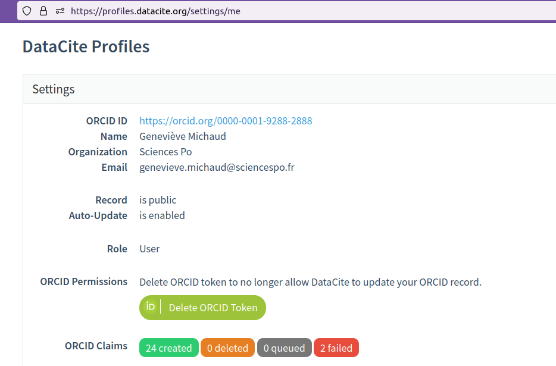
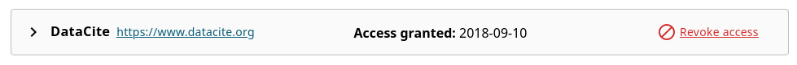
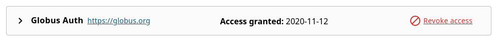
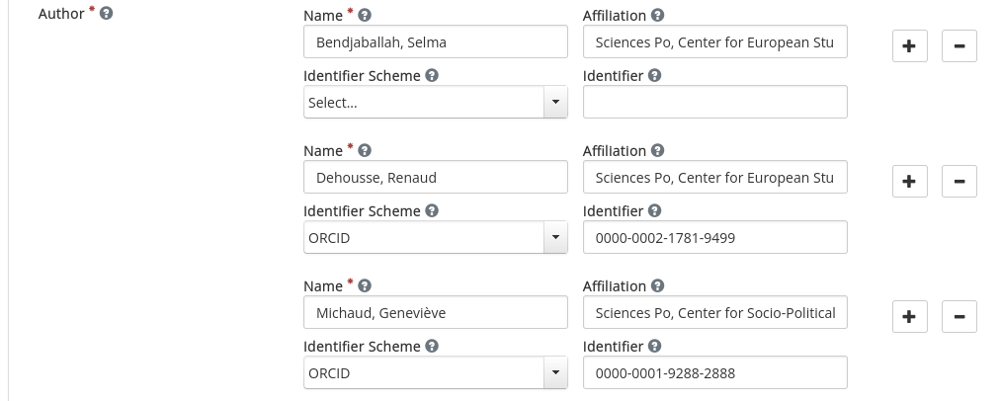
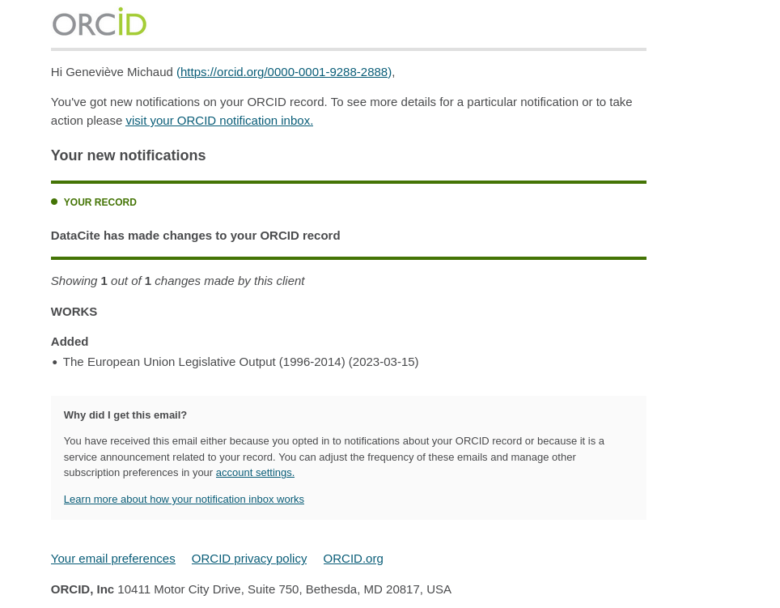
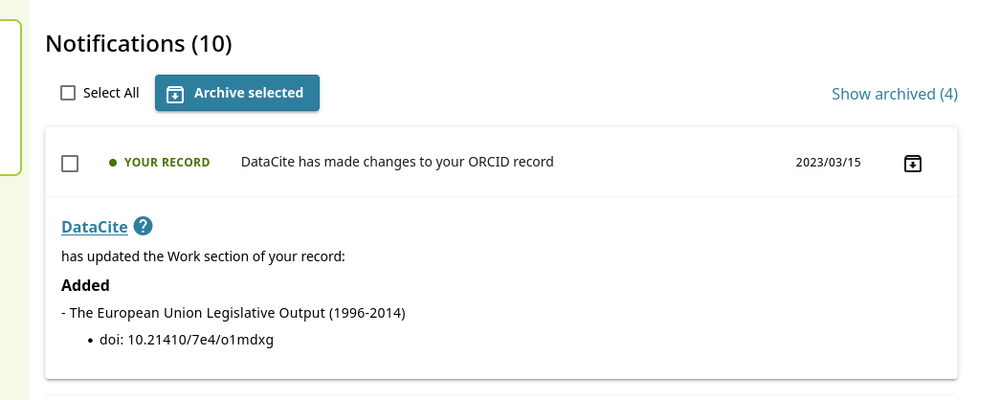
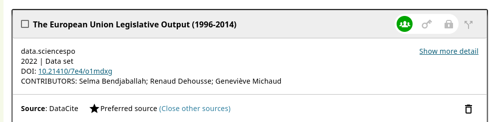
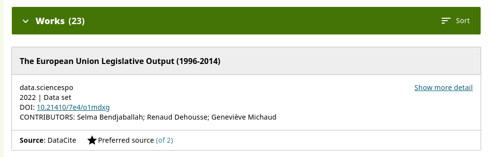

## 1. Rationale

Persistent identifiers (PIDs) and associated features are key elements to **capture metadata workflows** and **automatically update the research graph**.

See [Fenner, M., & Aryani, A. (2019). Introducing the PID Graph (https://doi.org/10.5438/JWVF-8A66)](https://doi.org/10.5438/jwvf-8a66).

The research graph describes relations between several type of resources; to make this graph machine-actionable, the use of PIDs and associated PIDs metadata is necessary. There are several emerging or well established PIDs, such as:

- PIDs for research data (why we are here in the first place!)
- PIDs for organizations and projects
- PIDs for researchers and contributors
- PIDs for software
- PIDs for publications

**We want to have a contributor or researcher ORCID profile automatically updated every time a dataset to which they contributed is published on Dataverse. This tutorial will help you set your ORCID record auto-update triggered by a dataset publication on a Dataverse repository (using DOIs as dataset PIDs).**

## 2. Prerequisites

- a Dataverse repository using Persistent Identifiers from DataCite called DOIs (Digital Object Identifiers). This feature is available since [Dataverse version 4.13 (dated 2016)](https://blog.datacite.org/dataverse-is-now-minting-dois-with-datacite/).
- your Open Researcher and Contributor identifier (ORCID iD). Registration is needed to get an [ORCID](https://info.orcid.org/documentation/features/orcid-registry/) iD and maintain and control an ORCID record. An ORCID identifier comes as a set of characters for instance `0000-0003-4074-2B76`.

## 3. Setup

### Step 1: Enable auto-update of ORCID record

#### Activate DataCite profile and set permissions

*This operation involves Globus (https://globus.org/), a non-profit DataCite partner.
You may want to check also [ORCID Client Terms of Use](https://info.orcid.org/public-client-terms-of-service/) and this statement about [personal data transfer by ORCID from EU to the US](https://info.orcid.org/our-principles-policies/faq-orcid-and-ecj-schrems-ii-decision/).*

To proceed, sign in with your ORCID account to the [Datacite profile service](https://profiles.datacite.org/). More info about [DataCite profiles here](https://support.datacite.org/docs/datacite-profiles-user-documentation).

Select `Settings` menu option. Create an ORCID token and enable auto-update to get a profile similar to this one:

#### Check updated ORCID account settings

You can check on your [ORCID account](https://orcid.org/trusted-parties), the list of your trusted third parties.
You should see now a Globus and a DataCite item, as shown below:

### Step 2: Publish metadata from Dataverse

On Dataverse, provide author metadata for a dataset, type in an `Author name`, select ORCID as `identifier scheme` and provide a valid ORCID iD as `identifier`. 

The dataset must be **published** for the auto-update to take place.

## 4. Auto-update in action

### Notifications

Whenever a dataset including your ORCID as an author metadata is published, you should receive notifications to inform you that DataCite has updated your ORCID record.

An email notification looks like:

An internal ORCID notification looks like:

### Editing ORCID record

Depending on your policy, you can now set the visibility level of this new record to public. More info on (default) visibility settings is available [here](https://support.orcid.org/hc/en-us/articles/360006897614).

### Checking ORCID public record

## 5. De-activating auto-update

You can revert this process by suspending auto-update with immediate effect.

Check on your [ORCID account](https://orcid.org/trusted-parties), the list of your registered trusted third parties. This is -to put it simply- the list of services you connected to using your ORCID.

Revoke permissions anytime by selecting `revoke access` for Datacite and Globus `third party` and as in step1.

You can additionally delete the `ORCID token`.

